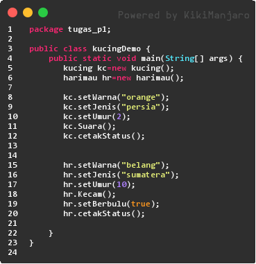
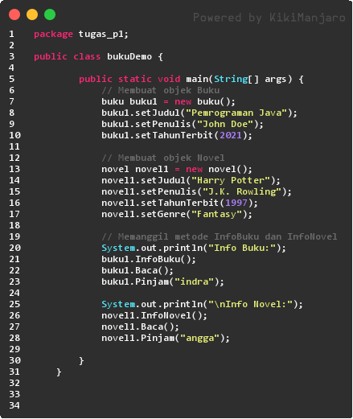


Pengantar Konsep Pemrograman Berorientasi Objek 

1. # Kompetensi 
Setelah menempuh materi percobaan ini, mahasiswa mampu mengenal: 

1. Perbedaan paradigma berorientasi objek dengan paradigma struktural 
1. Konsep dasar PBO 

1. # Pendahuluan 
2\.1 Pemrograman struktural vs berorientasi objek 

Perbedaan mendasar antara pemrograman terstruktur dengan pemrograman berorientasi objek (PBO) atau *Object Oriented Programming* (OOP) adalah: Pada pemrograman terstruktur, program dipecah kedalam sub-program atau **fungsi**. Sedangkan pada PBO, program dipecah kedalam **objek**, dimana objek tersebut membungkus **state** dan **method**. 

Kelebihan PBO adalah program dapat lebih fleksibel dan modular, jika ada perubahan fitur, maka dapat dipastikan keseluruhan program tidak akan terganggu. Berbeda dengan struktural, perubahan sedikit fitur saja kemungkinan dapat mengganggu keseluruhan program.  

Untuk lebih jelas, berikut perbedaan antara pemrograman terstruktur dengan pemrograman berorientasi object. 

|**Procedural Programming** |
**Object Oriented Programming** 

 
|
| :- | :- |
|
const roti = {nama: ‘Roti’, harga: 5000} const susu = {nama: ‘Susu’, harga: 8000) 

` `const keranjang = []; keranjang.push(roti); keranjang.push(roti); keranjang.push(susu); keranjang.push(susu); keranjang.push(susu); 

` `const total = keranjang 

  .map(product => produk.harga) 

  .reduce((a, b) => a + b, 0); 

` `console.log('Total bayar: ' + total);  
|
const roti = new Product('Roti', 

5000); const susu = new Product('Susu', 

8000) const keranjang = new Keranjang(); keranjang\.tambahProduk(2, roti); keranjang\.tambahProduk(3, susu); keranjang\.printShoppingInfo(); 
|

Berdasarkan dua buah potongan kode tersebut, kode program dalam bentuk perpektif objek jauh lebih dapat dipahami layaknya Bahasa manusia daripada kode program dalam Bahasa pemrograman terstruktur. Hal tersebut dibuktikan pada mulai baris pertama di kode program menggunakan objek, jelas bahwa objek baru dibuat menggunakan kata kunci **new** yang diikuti oleh nama kelasnya. Hal tersebut menandakan bahwa sebuah object dikembalikan ke sebuah variable  dan dapat dikatakan bahwa kosep OOP lebih efisien dibandingkan pemrograman terstruktur. 

**NB:** 

Didalam modul praktikum ini, kita akan mencoba membuat class, membuat object dan memanggil method-method yang ada didalam object. Penjelasan mengenai anatomi class (atribut, method) akan dibahas lebih detail di modul praktikum berikutnya. 

2\.2 Konsep dasar PBO 

Didalam PBO dikenal beberapa aspek, yaitu: 

1. Object 

Object adalah suatu rangkaian dalam program yang terdiri dari **state** dan **behaviour**. Object pada software dimodelkan sedemikian rupa sehingga mirip dengan objek yang ada di dunia nyata. Objek memiliki state dan behaviour. State adalah ciri-ciri atau atribut dari objek tersebut. Misal objek Sepeda, memiliki state **merek, kecepatan, gear** dan sebagainya. Sedangkan behaviour adalah perilaku yang dapat dilakukan objek tersebut. Misal pada Sepeda, behaviournya antara lain, **tambah kecepatan, pindah gear, kurangi kecepatan, belok**, dan sebagainya. 

 

Gambar 1. Objek pada software 

 

Gambar 2. Sepeda yang dimodelkan sebagai objek pada software 

1. Class 

Class adalah blueprint atau prototype dari objek. Ambil contoh objek sepeda. Terdapat berbagai macam sepeda di dunia, dari berbagai merk dan model. Namun semua sepeda dibangun berdasarkan blueprint yang sama, sehingga tiap sepeda memiliki komponen dan karakteristik yang sama. Sepeda yang anda miliki dirumah, adalah hasil **instansiasi** dari **class** sepeda. c. Enkapsulasi 

Disebut juga dengan **information-hiding**. Dalam berinteraksi dengan objek, seringkali kita tidak perlu mengetahui kompleksitas yang ada didalamnya. Contoh pada sepeda, ketika kita mengganti gear pada sepeda, kita tinggal menekan tuas gear yang ada di grip setang sepeda saja. Kita tidak perlu mengetahui bagaimana cara gear berpindah secara teknis. d. Inheritance 

Disebut juga **pewarisan**. Inheritance memungkinkan kita untuk mengorganisir struktur program dengan natural. Inheritance juga memungkinkan kita untuk memperluas fungsionalitas program tanpa harus mengubah banyak bagian program. Contoh di dunia nyata, objek sepeda dapat diturunkan lagi ke model yang lebih luas, misal sepeda gunung (mountain bike) dan road bike. Dimana masing-masing dapat memiliki komponen tambahan, misal sepeda gunung memiliki suspensi, yang tidak dimiliki sepeda biasa. Dalam hal ini, objek mountain bike dan road bike **mewarisi** objek sepeda. 

e. Polimorfisme 

Polimorfisme juga meniru sifat objek di dunia nyata, dimana sebuah objek dapat memiliki bentuk, atau menjelma menjadi bentuk-bentuk lain. Misalkan saja objek pesawat terbang. Objek ini dapat diwariskan menjadi pesawat jet dan pesawat baling-baling. Keduanya memiliki kemampuan untuk menambah kecepatan. Namun secara teknis, metode penambahan kecepatan antara pesawat jet dengan baling-baling tentu berbeda, karena masing-masing memiliki jenis mesin yang berbeda. 

1. # Percobaan 
3\.1 Percobaan 1 

Didalam percobaan ini, kita akan mendemonstrasikan bagaimana membuat class, membuat object, kemudian mengakses method didalam class tersebut. 

1. Buka Netbeans, buat project **SepedaDemo**. 
1. Buat class Sepeda. Klik kanan pada package **sepedademo** – New – Java Class. 
1. Ketikkan kode class Sepeda dibawah ini. 

![ref1]

4\.

Kemudian pada class main, ketikkan kode berikut ini.

5\. Cocokkan hasilnya: 

3\.2 Percobaan 2 

Didalam percobaan ini, akan didemonstrasikan salah satu fitur yang paling penting dalam PBO, yaitu inheritance. Disini kita akan membuat class **SepedaGunung** yang mana adalah turunan/warisan dari class Sepeda. Pada dasarnya class SepedaGunung adalah sama dengan class Sepeda, hanya saja pada sepeda gunung terdapat **tipe suspensi**. Untuk itu kita tidak perlu membuat class Sepeda Gunung dari nol, tapi kita wariskan saja class Sepeda ke class SepedaGunung. 

Penjelasan lebih detail tentang inheritance akan dibahas pada modul selanjutnya. 

1. Masih pada project **SepedaDemo**. Buat class **SepedaGunung**. 

1. Tambahkan kode **extends Sepeda** pada deklarasi class SepedaGunung. Kode extends ini menandakan bahwa class SepedaGunung mewarisi class Sepeda. 

3\.

Kemudian lengkapi kode SepedaGunung seperti berikut ini:

4\. Kemudian pada class main, tambahkan kode berikut ini: 

5\.

Cocokkan hasilnya:

Hasil  running percobaan

1. # Kesimpulan 
Dari percobaan diatas, kita telah mendemonstrasikan bagaimana paradigma pemrograman berorientasi objek dan mengimplementasikannya kedalam program sederhana. Kita juga telah mendemonstrasikan salah satu fitur paling penting dari PBO yaitu **inheritance**, yaitu dalam hal membuat class **SepedaGunung**.  

Kita ketahui bahwa SepedaGunung pada dasarnya adalah sama dengan **Sepeda** (memiliki gear, memiliki kecepatan, dapat menambah kecepatan, dapat mengerem, pindah gigi, dsb) namun ada fitur tambahan yaitu **tipe suspensi**. Maka kita tidak perlu membuat class SepedaGunung dari nol, kita **extends** atau wariskan saja dari class Sepeda, kemudian kita tinggal tambahkan fitur yang sebelumnya belum ada di class Sepeda. Inilah salah satu kelebihan PBO yang tidak ada di pemrograman struktural. 

1. # Pertanyaan 
1. Jelaskan perbedaan antara objek dengan class! 

Jawab: clas merupakan blueprint /template dari sebuah objek sedangkan objek instance konkret dari sebuah kelas 

1. Jelaskan alasan warna dan tipe mesin dapat menjadi atribut dari objek mobil! 

Jawab:karena warna mobil digunakan untuk mengidenifikasi penampilan visual sebuah mobil dan mesin mobil digunaka untuk menggambarkan jenis mesin yang digunakan sebuah mobil

1. Sebutkan salah satu kelebihan utama dari pemrograman berorientasi objek dibandingkan dengan pemrograman struktural! 

Jawab: jika menggunakan  objek tidak perlu membuat banyak variable sehingga meringkas sebuah kode

1. Apakah diperbolehkan melakukan pendefinisian dua buah atribut dalam satu baris kode seperti **“public String nama,alamat;”?** 

Jawab:tidak diperbolehkan karena program akan susah dibaca oleh programer

1. Pada class SepedaGunung, jelaskan alasan atribut merk, kecepatan, dan gear tidak lagi ditulis di dalam class tersebut!  

Jawab:karena atribut merk sudah di deklarasikan di parent class sehingga tidak perlu menuliskan lagi didalam child class nya
1. # Tugas Praktikum 
1\. Lakukan langkah-langkah berikut supaya tugas praktikum yang dikerjakan tersistematis: 

1. Foto 4 buah objek di sekitar kalian dengan 2 objek di antaranya merupakan objek yang mengandung konsep pewarisan (inheritance), contoh: kulkas, kursi, meja ruang tamu, meja belajar sehingga diketahui meja ruang tamu dan meja belajar mewarisi objek meja!  
1. Kucing

1. Harimau

1. Buku

1. Novel

1. Lakukan pengamatan terhadap 4 objek tersebut untuk menentukan atribut dan methodnya! 
1. kucing

Atributnya warna,umur,jenis

Methodnya:makan,suara,mencakar

1. harimau

atributnya warna, umur, jenis,bulu

methodnya :makan,suara,mencakar,kecam

1. buku

atributnya:judul ,penulis,th terbit

method:info buku,baca,pinjam

1. novel

atributnya :judul,penulis,th terbit,genre

method:info novel,baca,pinjam

1. Berdasarkan 4 buah objek tersebut, buat class nya dalam Bahasa pemrograman Java!  
1. Perlu diperhatikan bahwa terdapat dua class hasil pewarisan sehingga perlu menambah satu class baru sebagai class yang mewarisi dua class tersebut! 
1. Tambahkan dua atribut untuk setiap class! 
1. Tambahkan tiga method untuk setiap classtermasuk method cetak informasi! 
1. Tambahkan satu class Demo sebagai main! 
1. Instansiasikan satu buah objek untuk setiap class! 
1. Terapkan setiap method untuk setiap objek yang dibuat! 
1. Contoh yang telah disebutkan pada poin 1.a tidak diperbolehkan dipakai dalam pengerjaan tugas praktikum ini! 

Hasil running

Hasil running

[ref1]: Aspose.Words.e0bbe851-07b2-4e64-b1b6-5bea4003408d.003.png
